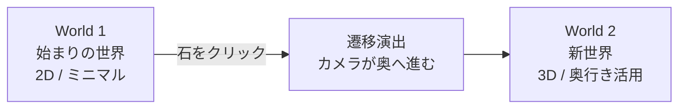
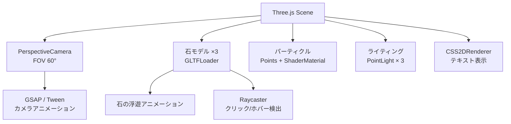

# World 2 空間設計コンセプト

World 1（始まり・弘前・温故）からWorld 2（東京・新世界・知的再生）への遷移と、  
3D空間を活用した情報提示の設計案。

---

## World の全体構造



| | World 1 | World 2 |
|--|---------|---------|
| 空間 | 2D（Canvas） | 3D（Three.js） |
| 雰囲気 | 温故・幻想・湿度ある闇 | 静謐・知的・クリーンな闇 |
| 色調 | ティール系の暖かい光 | 白〜ペールブルーの冷たい光 |
| 石 | 自然石・苔・湯気 | 同じ石だが光が洗練される |
| カメラ | 固定（正面2D） | 自由（パン/ズーム/回転） |

---

## 遷移演出：World 1 → World 2

石をクリックした瞬間、以下の演出を想定：

1. **カメラが石に吸い込まれる**（ズームイン + ブラー）
2. **暗転**（0.5秒程度）
3. **World 2が奥から迫ってくる**（カメラが前方へ移動するイメージ）
4. 選択した石のコンテンツが**前面に展開**

> [!NOTE]
> この遷移は Three.js のカメラアニメーションで実現。GSAP等のトゥイーンライブラリと組み合わせると滑らかに制御できます。

---

## World 2 の空間レイアウト

### コンセプト：「奥行きのある知の空間」

```
カメラ（ユーザー視点）
    |
    |  ← 近い（Z = 0）
    |
    |  ▓▓▓▓▓▓▓▓▓▓▓▓▓▓▓
    |  ▓  選択した石の  ▓  ← メインコンテンツ（前面）
    |  ▓  詳細情報      ▓
    |  ▓▓▓▓▓▓▓▓▓▓▓▓▓▓▓
    |
    |  ← 中間（Z = -5）
    |
    |        ○          ← 石B（中景でゆっくり浮遊）
    |            ○      ← 石C（中景でゆっくり浮遊）
    |
    |  ← 遠い（Z = -15）
    |
    |  ．．．．．．．．  ← 微かなパーティクル（深遠さを演出）
```

### サービス紹介を選択した場合の例

```
[前面 Z=0]   サービス紹介コンテンツ
              ├── タイトル「サービス」
              ├── 3Dモデリング
              ├── VR家具配置
              └── 360°コンテンツ

[中景 Z=-5]  会社紹介の石 ← ゆっくり回転しながら漂っている
             開発事例の石 ← 同上、クリックすると前面に来る

[遠景 Z=-15] パーティクル + 微かなグリッドライン
```

### 石の切り替え

中景の石をクリックすると：

1. 現在の前面コンテンツが**後方へスライドして消える**
2. クリックされた石が**前面へ浮上**してくる
3. 新しいコンテンツが**石から展開**するように表示される
4. 元の石は**中景に下がる**

> [!TIP]
> ナビゲーションを石自体に統合することで、ヘッダーメニュー不要のまま直感的な移動が可能になります。

---

## 情報の提示方法

### 方式：「石から情報が浮かび上がる」

選択した石を中心に、テキストやカード型の情報がゆっくり浮上・展開する。

```
        ┌──────────────┐
        │  タイトル      │  ← テキストは Three.js の
        │              │     CSS2DRenderer で描画
        │  本文テキスト   │     （DOM要素を3D空間に配置）
        │              │
        └──────────────┘
              ↑
          ゆっくり浮上
              ↑
            [石]
```

| 要素 | 描画方法 | 理由 |
|------|---------|------|
| 石 | Three.js 3Dモデル | リアルな質感・光の反射 |
| テキスト | CSS2DRenderer (DOM) | フォントの品質、アクセシビリティ、SEO |
| パーティクル | Three.js Points | GPU描画でパフォーマンス良好 |
| 背景 | Three.js + Shader | 動的な背景エフェクト |

> [!IMPORTANT]
> テキストは CSS2DRenderer を使うことで、通常のHTML/CSSとして描画されます。これにより：
> - フォントの品質が保たれる
> - コピー&ペーストが可能
> - アクセシビリティ対応が容易
> - SEO的にも有利

---

## 技術構成（World 2）



### 移行パス

```diff
- SceneManager (Canvas 2D)    ← 現在
+ SceneManager3D (Three.js)   ← World 2
```

`SceneManager` と同じインターフェースを持つ `SceneManager3D` クラスを新規作成。  
`main.js` のルーターでWorld遷移時にシーンを切り替える設計。

---

## World 2 のカラーパレット

| 用途 | 色 | HSL |
|------|-----|-----|
| 背景（深部） | `#050810` | H220 S50% L3% |
| 背景（中間） | `#0a1020` | H220 S50% L8% |
| アクセント光 | `#a8c8ff` | H220 S100% L83% |
| テキスト | `#e0e8f5` | H220 S40% L92% |
| テキスト薄 | `#6080a0` | H210 S30% L50% |
| 石のエミッション | `#8ab4ff` | H220 S100% L77% |

> World 1のティール系と対比させ、World 2はペールブルー〜白系で「知的・静謐」を表現。

---

## 今後の拡張性

- **World 3, 4...** : ルーターに新Worldを追加するだけ
- **各World独自のシーン** : `SceneManagerN` を差し替え可能
- **カメラワーク** : GSAP タイムラインで複雑なカメラ移動を記述可能
- **コンテンツ動的読み込み** : 各カテゴリのコンテンツをJSON/MDから動的に取得する構造に拡張可能

---

## 実装優先度

| 優先度 | 内容 |
|--------|------|
| 🔴 高 | Three.js シーン基盤、石モデルの読み込み、カメラアニメーション |
| 🟡 中 | CSS2DRenderer でテキスト配置、中景の石の浮遊と切り替え |
| 🟢 低 | シェーダー背景、高度なパーティクル、World遷移演出のリッチ化 |
